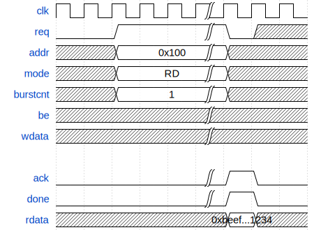
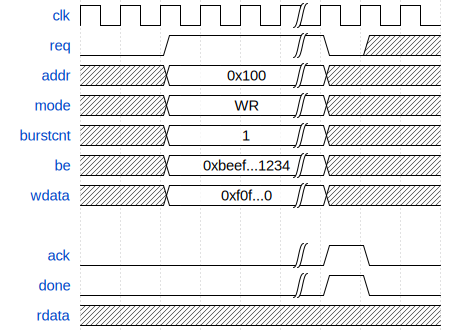
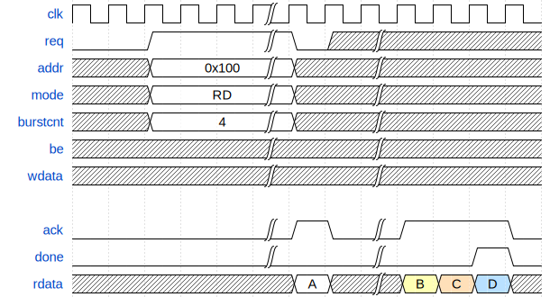
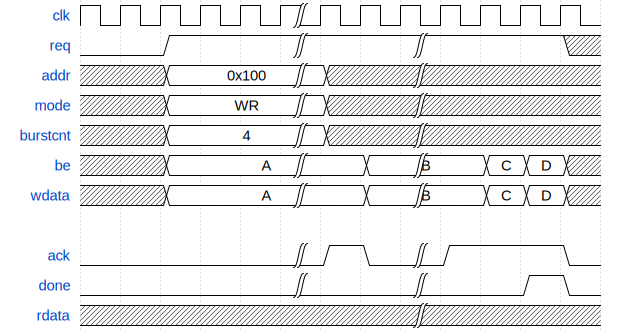
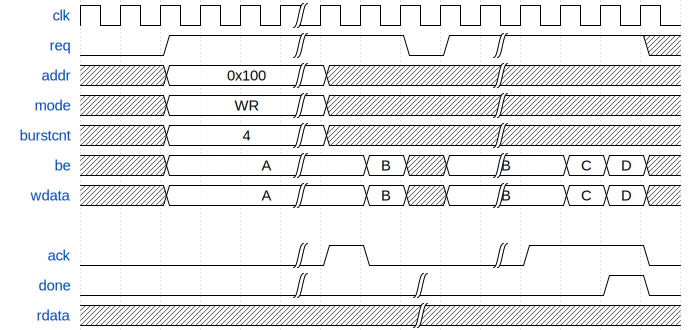

# stmi_lib
A VHDL library for a memory interface which supports a single transfer at a time.
Such a transfer may be a single bus word transfer but also a burst transfer.

This library contains an arbiter for multiple masters accessing a single slave as well as an example slave adapter to a Xilinx MIG DDR3 IP Core.
Also, an adapter for the simple cache interface used by my [generic cache library](https://github.com/RLux8/generic_cache_lib) is provided.

## Signals
### Master to slave
* req: Transaction request or bus word to be written is valid
* addr: Byte address at start of transfer, subsequent words are at following byte addresses (+0x20, +0x40, ...)
* mode: Transfer mode
* burstcnt: Number of bus words to be transported during transaction
* be: Byte enable for current bus word (same order as writedata eg. bit 0 corresponds to bits 7-0 of writedata)
* writedata: Bus word to be written

### Slave to master
* ack: Acknoledge transfer of a single bus word
* done: Transaction is complete, next transaction will be processed in next clock cycle
* readdata: Requested bus word

## Exemplary transfers ##
### Read transfer ##

An exemplary read transfer in which the bus word starting at address 0x100 is read.
### Write transfer ##

An exemplary write transfer in which a masked bus word is written to memory starting at address 0x100.
### Burst read transfer ##

An exemplary burst read transfer in which the bus words located in memory at the byte addresses 0x100, 0x120, 0x140 and 0x160.
Those words are acknoledged by the ack signal and the transfer completion is signalled by the done signal.
Note that the request signal may be lowered during the transaction after the transfer has begun, marked by the first ack pulse.

### Burst write transfer ##

An exemmplary burst read transfer in which masked bus words are written to byte addresses 0x100, 0x120, 0x140 and 0x160.
Those words are acknoledged by the ack signal and the transfer completion is signalled by the done signal.

The same transfer, but showing the possibility of lowering the req signal during the transfer to pause the write transfer.
